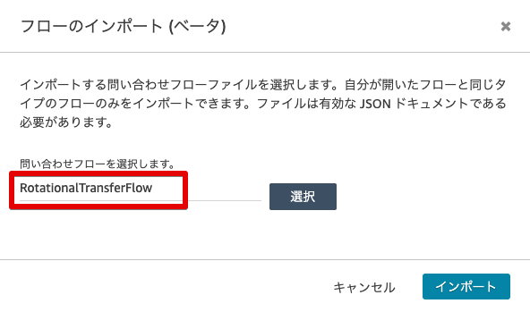

# AmazonConnect-Extended-RotationalTransfer

Amazon Connectの拡張（ローテーション転送）

本ドキュメントは、下記が予め利用可能になっている事が前提となっております。

* git/yarn
* AWS CLI
* AWS SAM (samコマンドのみ)
* TypeScript
* VSCode（必須ではありません）

## 1 概要

Amazon Connectにローテンション機能をもつ外部転送を行う処理を追加するものです。
S3上の設定ファイル（RotationalTransfer.txt）を編集することで、転送の優先順位、再生メッセージが設定可能です。


## 2 セットアップ

GitHubからプロジェクトをcloneして下さい。

```
$ git clone https://github.com/furuya02/AmazonConnect-Extended-RotationalTransfer.git
$ cd AmazonConnect-Extended-RotationalTransfer
```
事後の作業は、全てappの中で行います。

```
$ cd app
```
外部モジュールのダウンロード

```
[app]$ cd src;yarn install;cd ..
[app]$ cd dst;yarn install;cd ..
[app]$ chmod 755 .vscode/deploy.sh
```

本プロジェクトは、VSCode上で作業すると、快適に作業できるようセットアップされています。

```
[app]$ code . （ <= ドットを忘れないように）
```


## 3 構成
プロジェクトのファイル構成は、概ね以下のとおりです。

```
├── README.md
├── images (ドキュメント用画像)
├── sample
│   ├── RotationalTransfer.txt (時間設定のサンプル)
│   └── RotationalTransferFlow（問い合わせフローのサンプル）
└── app
    ├── dst (js出力)
    │   ├── yarn.lock (デプロイ用)
    │   ├── package.json (デプロイ用)
    │   └── node_modules(デプロイ用)
    ├── src (tsソースコード)
    │   ├── yarn.lock (TS用)
    │   ├── package.json (TS用)
    │   ├── node_modules(TS用)
    │   ├── tsconfig.json (TypeScript設定)
    │   └── index.ts
    └── template.yml (AWS SAM テンプレート)
```

## 4 コンパイル

**tsc**でコンパイルして、jsファイルを生成します。
app/tsconfig.jsonに設定ファイルがあり、これを元にコンパイルすることで、dst/配下にjsファイルが出力されます。

```
[app]$ tsc --build src/tsconfig.json
```

VSCodeでは、Shift+Cmd+b（ビルドタスクの実行）で表示される選択から、tsc:ウォッチ（常時動作）若しくは、tsc:ビルド（１回のみ）　でコンパイルできます。


## 5 デプロイ

**sam package**及び、**sam deploy**コマンドでデプロイします。
SAMによるパッケージ作成のために、予め、S3のバケットが必要です。

```
[app]$ export Profile=プロファイル名
[app]$ export BucketName=S3バケット名
[app]$ export StackName=Connect-Extended-Operation-Of-Tiime
[app]$ sam package --output-template-file packaged.yaml --s3-bucket ${BucketName} --p ${Profile}
[app]$ sam deploy --template-file packaged.yaml --stack-name ${StackName} --capabilities CAPABILITY_IAM --p ${Profile} 
```

VSCode上でデプロイするには、Cmd+d（カスタム：タスク実行）で表示される選択から、**deploy**タスクを選択します。


**deploy**タスクは、**.vscode/task.json**で下記のように、**.vscode/deploy.sh**を実行するように設定されています。

```json
{
    "version": "2.0.0",
    "tasks": [
        {
            "label": "deploy",
            "type": "shell",
            "command": ".vscode/deploy.sh",
            "problemMatcher": []
        }
    ]
}
```
バケット名などパラメータの変更は、**.vscode/deploy.sh**の環境変数を編集して下さい。
```sh
export Profile=プロファイル名
export BucketName=バケット名

#--------------- SAM更新 ---------------------------
export StackName=Connect-Extended-RotationalTransfer

sam package --output-template-file packaged.yaml --s3-bucket ${BucketName} --p ${Profile}
sam deploy --template-file packaged.yaml --stack-name ${StackName} --capabilities CAPABILITY_IAM --p ${Profile} 
```

## 6 リソース

デプロイされるリソースは、以下の3つです。すべてのリソースは、スタック名で始まります。

* S3バケット（設定ファイルのアップロード用）
* Lambda関数
* Lambda用のRole


## 7 設定ファイル

設定ファイルをS3バケットにアップロードします
。

バケットは、CloudFormationの出力に表示されているバケット名になります。


```
[app]$ export Profile=プロファイル名
[app]$ export BucketName=バケット名
[app]$ aws s3 cp ../sample/RotationalTransfer.txt s3://${BucketName}/ --profile=${Profile}
```


## 8 設置

本プロジェクトを設置する手順は、以下のとおりです。

* インスタンスへのLambdaの追加
* 問い合わせフローの設置
* **AWS Lambda関数を呼び出す**ブロックの設定

### (1) インスタンスへのLambdaの追加

* インスタンスの設定で、**AWS Lambda**関数を追加します。関数名は、CloudFormationの出力で確認して下さい。


### (2) 問い合わせフローの設置

問い合わせフローのサンプル(sample/RotationalTransferFlow)をインポートします。




### (3) **AWS Lambda関数を呼び出す**ブロックの設定

* **AWS Lambda関数を呼び出す**ブロックのオプションで、関数を選択します。

パラメーターは、「属性を使用する」「外部」「counter」が設定されています。これにより、ループの何回目の処理かをLambdaで判断できるようになります。


## 9 設定

設定要領は、拠点の電話番号と、ローテーションの設定の２種類です。

### (1) 拠点の電話番号
[TELNO]と[/TELNO]の間で設定し、2カラム目に電話番号を記載します。

ローテーションで使用するのは、何行目の拠点を使用するかだけですので、1カラム目は、記述方法に制約はありません。

```
#####################################
# 拠点電話番号設定
#####################################
[TELNO]
(0)SAPPORO,+819011111111
(1)OOSAK,+819022222222
(2)TOKYO,+819033333333
(3)YOKOHAMA,+819044444444
(4)SAITAMA,+819055555555
[/TELNO]
```

### (2) ローテーションの設定

ローテーション設定は、[DEFAULT]と、それの上書き設定となります。

1カラム目:拠点
2カラム目:タイムアウト（秒）
3カラム目:転送の前にアナウンスを入れる

下記の例では、
1. 拠点0に転送し、15秒でタイムアウト
2. 拠点2に転送し、15秒でタイムアウト
3. 「申し訳ございません・・・」のアナウンス後に、拠点4に転送し、15秒でタイムアウト
この動作を、電話にでるまでループします。

```
#####################################
# デフォルト設定
#####################################
[DEFAULT]
0,15,
2,15,
4,15,申し訳ございません。只今、混み合っております、そのまま、お待ち頂くか、おかけ直し下さい。
[/DEFAULT]
```

ローテーションの設定は、特定の日時だけ[DEFAULT]の設定を上書きできます。

下記の設定は、月曜日の09:00〜12:00の間だけ、デフォルトのローテーションを上書きします。

```
#####################################
# 月曜の9:00-12:00の設定
#####################################
[SET]月,0900,1200
3,15,
2,15,
1,15,申し訳ございません。只今、混み合っております、そのまま、お待ち頂くか、おかけ直し下さい。
[/SET]
```

なお、空行や、#以降（コメント）は、無視されます。

**RotationalTransfer.txt**
```
#####################################
# 拠点電話番号設定
#####################################
[TELNO]
(0)SAPPORO,+810011111111
(1)OOSAK,+810022222222
(2)TOKYO,+810033333333
(3)YOKOHAMA,+810044444444
[/TELNO]

#####################################
# デフォルト設定
#####################################
[DEFAULT]
0,15,
1,15,
2,15,
3,15,
4,15,申し訳ございません。只今、混み合っております、そのまま、お待ち頂くか、おかけ直し下さい。
[/DEFAULT]

#####################################
# 月曜の9:00-12:00の設定
#####################################
[SET]月,0900,1200
3,15,
1,15,申し訳ございません。只今、混み合っております、そのまま、お待ち頂くか、おかけ直し下さい。
[/SET]

```

## 10 デバック

VSCodeでは、F5キーを押すことでローカルでデバック実行が可能です。ブレークポイントを指定して、トレースすることもできます。


ローカルでデバッグ実行する際の環境変数は、**.vscode/launch.json**で設定します。

**BucketName**にCloudformationの出力（バケット名）を設定して下さい。


